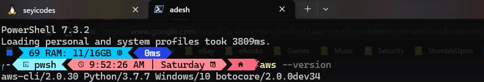
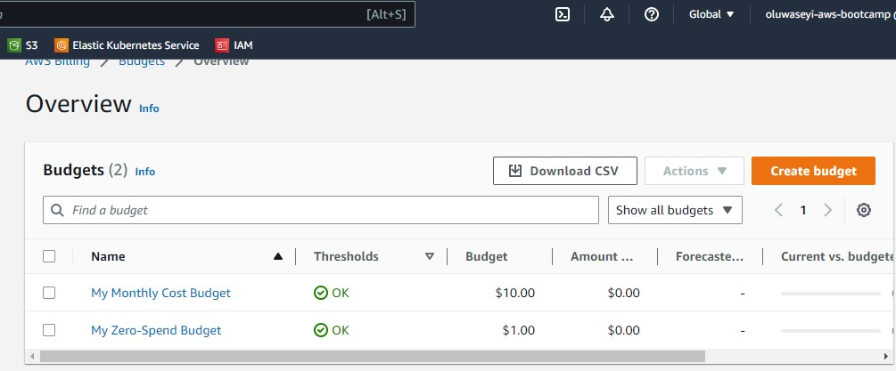
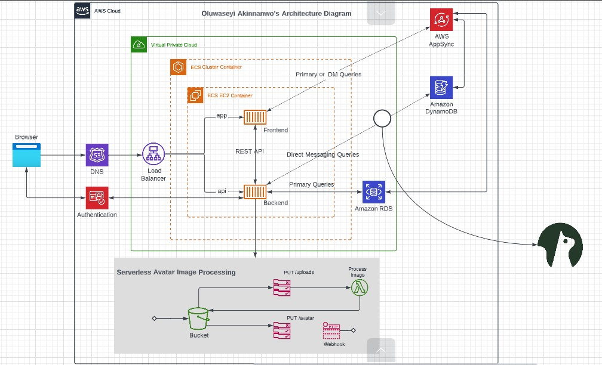

# Week 0 — Billing and Architecture

## Our assignment this week

### To setup our aws cli

```
I was able to setup the aws cli pretty easily. I attached an image of the cli version below. 
```


---

### To setup our project budgets



---
### To recreate the  logical architecture




[Link to the Logical architecture diagram](https://lucid.app/lucidchart/c8bc3812-1111-4fdc-a7a8-4221d9597f9a/edit?viewport_loc=522%2C54%2C2348%2C1013%2C0_0&invitationId=inv_bd414ebf-ad6a-448c-8c87-a8295855b61e)
